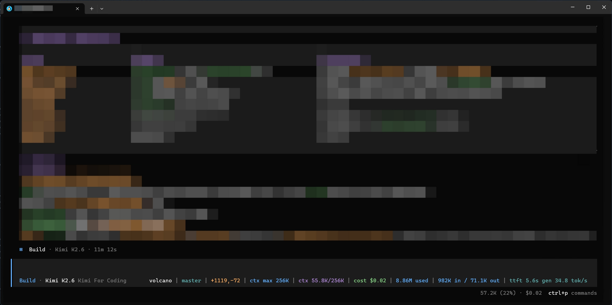
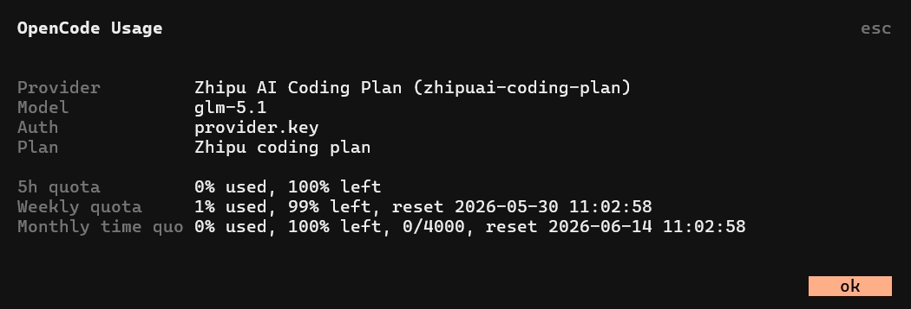

# opencode-statusline

[中文](README.md) | [English](README.en.md) | [日本語](README.ja.md)

OpenCode TUI 插件，用于在 TUI 内查看 provider usage/quota，并按需扩展 prompt statusline。

它提供：

- `/usage`：在 TUI dialog 中查看当前活跃模型所属 provider 的 quota、usage、balance 等信息。
- `/statusline`：选择要追加到 OpenCode prompt 模型/provider 后面的状态字段。
- 彩色 statusline 字段，并严格按选择顺序显示。
- 不污染聊天上下文：usage 和 statusline 信息只渲染在 TUI 中，不写入对话历史。

## 截图

OpenCode prompt 中追加的示例 statusline 字段：



`/usage` provider quota dialog：



## 安装

克隆并构建插件：

```sh
git clone https://github.com/kalcohol/opencode-statusline.git
cd opencode-statusline
npm install
npm run build
```

查看插件目录的绝对路径：

```sh
pwd
```

把这个绝对路径加入 OpenCode 的 TUI 配置。常见的全局配置文件是：

```text
${XDG_CONFIG_HOME:-~/.config}/opencode/tui.jsonc
```

如果目录或文件还不存在，可以先创建并打开：

```sh
mkdir -p "${XDG_CONFIG_HOME:-$HOME/.config}/opencode"
${EDITOR:-vi} "${XDG_CONFIG_HOME:-$HOME/.config}/opencode/tui.jsonc"
```

使用 `pwd` 输出的绝对路径：

```jsonc
{
  "$schema": "https://opencode.ai/tui.json",
  "plugin": ["/absolute/path/to/opencode-statusline"]
}
```

如果已经有其他插件，把本插件路径追加到已有的 `plugin` 数组：

```jsonc
{
  "$schema": "https://opencode.ai/tui.json",
  "plugin": [
    "/absolute/path/to/another-plugin",
    "/absolute/path/to/opencode-statusline"
  ]
}
```

修改插件配置或重新构建后，重启 OpenCode TUI。进入 OpenCode 后运行 `/usage` 或 `/statusline`，能打开对应界面就说明插件已加载。

更新已有 clone：

```sh
cd /absolute/path/to/opencode-statusline
git pull
npm install
npm run build
```

然后重启 OpenCode TUI。

当前插件不要求配置 `opencode.json`，但在其中保留同一个插件路径也没有问题：

```jsonc
{
  "$schema": "https://opencode.ai/config.json",
  "plugin": ["/absolute/path/to/opencode-statusline"]
}
```

常见全局配置位置：

```text
${XDG_CONFIG_HOME:-~/.config}/opencode/tui.jsonc
${XDG_CONFIG_HOME:-~/.config}/opencode/opencode.jsonc
```

也支持项目内配置：

```text
<project>/.opencode/tui.jsonc
<project>/.opencode/opencode.jsonc
```

OpenCode 会从当前项目目录向上查找 `tui.json(c)` 和 `opencode.json(c)`。如果设置了 `OPENCODE_CONFIG_DIR`，则使用该目录代替全局默认目录。

## 命令

### `/usage`

显示当前活跃模型所属 provider 的 usage/quota 信息。这个 dialog 不会发起模型请求，也不会把 usage 信息写入对话。

命令会从当前 session、近期 TUI 模型状态或 `config.model` 解析活跃 provider/model。每次打开 `/usage` 都会重新请求 provider 数据。

重置时间按本地时间显示，并使用固定宽度的 `YYYY-MM-DD HH:mm:ss` 格式。

### `/statusline`

打开字段选择器。选择字段会切换启用状态；字段选择顺序就是 prompt statusline 中的显示顺序。

可用字段：

| 字段 | 说明 |
| --- | --- |
| Repository | worktree 或目录 basename |
| Branch | 当前 git 分支名 |
| Git diff stats | tracked 文件的 staged+unstaged 增删行数，格式为 `+123,-45` |
| Context used | 最新 assistant 消息的上下文 token 估算 |
| Context remaining | 模型上下文上限减去当前上下文估算 |
| Context length | 当前模型上下文上限 |
| Context used/total | 紧凑的已用/总上下文显示 |
| TTFT/speed | 近似首 token 延迟和输出 token 生成速度；新回复未完成时保留上一条完整指标 |
| Subagent status | 活跃 subagent 或 child-session 状态；idle/completed 的 child 会被省略 |
| Main agent status | 当前主 session 状态，不带 `agent` 前缀 |
| 5h quota | provider 5h quota 使用百分比，有数据时显示 |
| Weekly quota | provider weekly quota 使用百分比，有数据时显示 |
| Session input/output tokens | 当前 session 和 child-session 累计输入/输出 token，格式为 `<input> in / <output> out` |
| Session total tokens | 当前 session 和 child-session 累计总 token，格式为 `<total> used`；OpenCode 暴露 reasoning/cache token 时会计入 |
| Session cost | 当前 session 和 child-session 累计成本，格式为 `cost $0.02`；按模型价格估算时显示为 `eq $0.02` |

没有的数据会自动省略。例如 OpenRouter 有 balance 和 usage totals，但没有 coding plan 意义上的 5h subscription quota window，因此不会显示 `5h quota`。

`Git diff stats` 只读取本地 git 工作树，使用 `git diff --numstat` 和 `git diff --cached --numstat` 汇总 tracked 文件相对 HEAD 的变化；未跟踪文件和二进制文件不会计入。该字段随 statusline 刷新重算，并在 session 更新时清除短缓存，避免流式输出期间频繁执行 git。

对于订阅制或 coding plan provider，`Session cost` 可能只是按 token 单价折算的等价估算，不一定代表真实扣费。它优先使用 OpenCode 记录在 message 上的 cost；没有记录时才回退到模型 catalog pricing。

Statusline 会保留 OpenCode 原有的 prompt 右侧内容。插件会测量已有右侧内容并动态截断本插件字段，避免换行挤坏 prompt 布局。

## 支持的 Providers

`/usage` 和 quota statusline 字段当前支持以下 provider ID。匹配不区分大小写。

| Provider / plan | Provider IDs | 凭据提示 | 有数据时显示 |
| --- | --- | --- | --- |
| Z.ai coding plan | `zai`, `zai-coding-plan` | `ZAI_API_KEY`, `ZAI_CODING_PLAN_API_KEY` | 5h/daily/weekly token quota，time quota |
| Zhipu coding plan | `zhipu`, `zhipuai`, `zhipu-coding-plan`, `zhipuai-coding-plan` | `ZHIPU_API_KEY`, `ZHIPU_CODING_PLAN_API_KEY` | 5h/daily/weekly token quota，time quota |
| Kimi Code | `kimi`, `kimi-code`, `kimi-for-coding` | `KIMI_API_KEY`, `KIMI_CODE_API_KEY` | usage windows，包括存在时的 5h window |
| MiniMax CN coding plan | `minimax`, `minimax-china-coding-plan`, `minimax-cn-coding-plan` | `MINIMAX_CHINA_CODING_PLAN_API_KEY` | 5h 和 weekly token quota |
| DeepSeek | `deepseek` | `DEEPSEEK_API_KEY` | account balance 和 availability |
| OpenRouter | `openrouter` | `OPENROUTER_API_KEY` | key label、remaining limit、total limit、usage totals |
| OpenCode Go | `opencode-go`, `opencodego` | `OPENCODE_GO_WORKSPACE_ID`, `OPENCODE_GO_AUTH_COOKIE` | 5h、weekly、monthly dashboard quota |
| OpenAI / ChatGPT / Codex OAuth | `openai`, `codex`, `chatgpt` | OpenCode `auth.json` OAuth entry | ChatGPT plan、5h/weekly quota、code review quota、credits |

API key 类 provider 按以下顺序解析凭据：

1. 环境变量
2. OpenCode `provider.<id>.options.apiKey`
3. runtime provider key
4. OpenCode `auth.json`

OpenAI/ChatGPT/Codex usage 使用 `auth.json` 中的 OAuth。`opencode` / OpenCode Zen 会被识别，但 OpenCode Zen 目前没有公开的 balance/quota API，因此 quota 字段会省略。

详细 endpoint 说明见 [doc/provider-query-methods.md](doc/provider-query-methods.md)。

## 状态文件

Statusline 字段选择保存到：

```text
${XDG_DATA_HOME:-~/.local/share}/opencode/statusline-plugin.json
```

可用环境变量覆盖：

```text
OPENCODE_STATUSLINE_CONFIG=/path/to/statusline-plugin.json
```

TUI 内切换模型后，插件会从 OpenCode 最近模型状态读取：

```text
${XDG_STATE_HOME:-~/.local/state}/opencode/model.json
```

可用环境变量覆盖 state 目录：

```text
OPENCODE_STATUSLINE_STATE_DIR=/path/to/opencode-state
```

## 开发

常用命令：

```sh
npm run typecheck
npm test
npm run build
```

如果本地 `/tmp` 挂载点拒绝 Node/Vitest 写入，可以把 `TMPDIR` 指向项目内被忽略的临时目录：

```sh
mkdir -p .tmp
TMPDIR=$PWD/.tmp npm test
```

OpenCode 从 `dist/tui.tsx` 解析 TUI entry，因此改源码后要先运行 `npm run build` 再在 TUI 中测试。

源码结构：

```text
src/
  index.ts                 package server entry
  plugin.ts                empty server shim
  tui.tsx                  TUI slots, dialogs, slash commands, statusline rendering
  lib/
    auth.ts                env/config/auth.json credential lookup
    opencode-client.ts     active model resolution helpers
    providers.ts           provider usage collectors
    statusline.ts          statusline field renderer
    statusline-config.ts   persisted field selection
    tui-usage.ts           /usage dialog text builder
    usage-format.ts        usage report formatting
    format.ts              shared formatting helpers
```

架构细节见 [doc/plugin-architecture.md](doc/plugin-architecture.md)。
